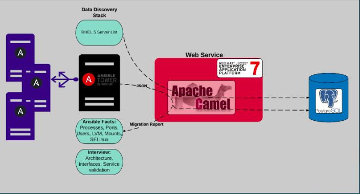

# AnsibleWebFront

# Diagram

# Description

This project was generated with [Angular CLI](https://github.com/angular/angular-cli) version 1.5.4

## Development server

Run `ng serve` for a dev server. Navigate to `http://localhost:4200/`. The app will automatically reload if you change any of the source files.

## Integration server

Run `ng serve --environment=int` for a dev server. Navigate to `http://localhost:4200/`. The app will automatically reload if you change any of the source files.

## Build

Run `ng build` to build the project. The build artifacts will be stored in the `dist/` directory. Use the `--prod` flag for a production build.

## Running unit tests

Run `ng test` to execute the unit tests via [Karma](https://karma-runner.github.io).

## Running end-to-end tests

Run `ng e2e` to execute the end-to-end tests via [Protractor](http://www.protractortest.org/).
Before running the tests make sure you are serving the app via `ng serve`.

## Build Docker image

The Docker image build requires the node-sass-alpine image customized for this application. The node-sass-alpine Dockerfile adds the Sass binaries to the node 9.2.0 alpine image. This is the base image for the application. For the application build, the Dockerfile will copy in the application content, and generate a build by executing ng build --prod --build-optimizer to create the optimized build. The docker will execute this build in production mode, exposing the port 4200.

To build the node-sass image, navigate to the node-sass-docker sub-directory
$ docker build -t node-sass-alpine:latest .

To build the application image:
$ docker build -t ansible-front .

To run the build
$ docker run --name ansible-front -d -p 4200:4200 ansible-front  
